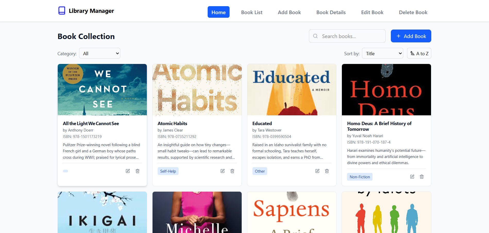
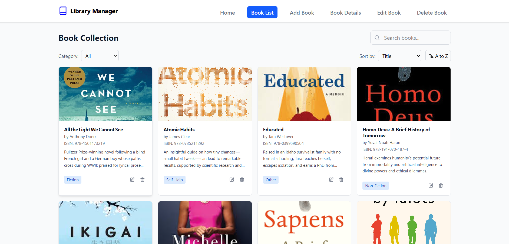
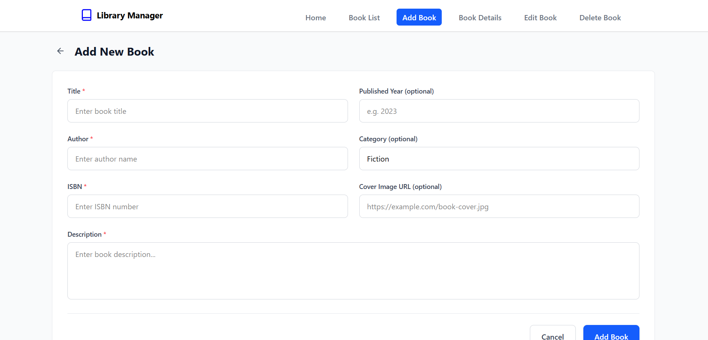
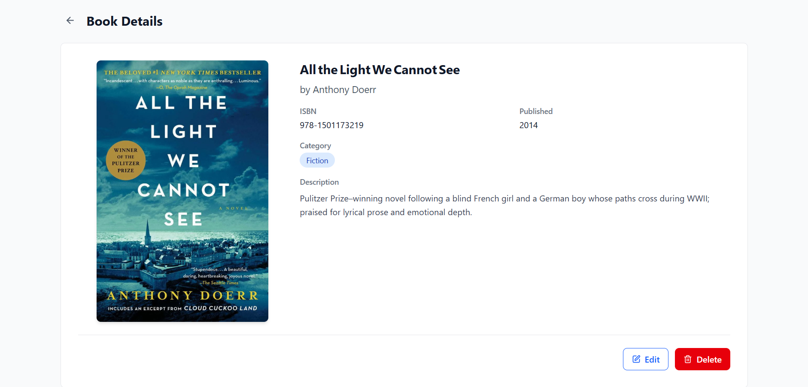
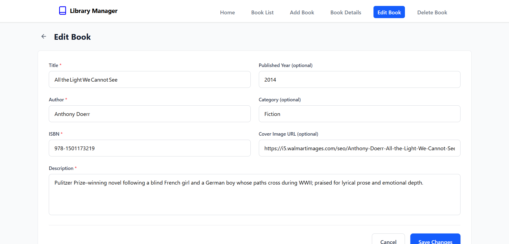
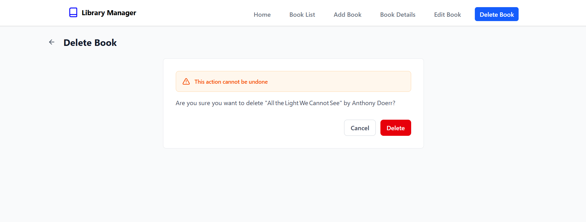

# Library Management System

A modern and responsive React application for managing a library's book collection. The system allows librarians to manage books with features like adding, editing, viewing details, and deleting books.

## 📋 Table of Contents
- [Overview](#overview)
- [Features](#features)
- [Technology Stack](#technology-stack)
- [Screenshots](#screenshots)
- [Getting Started](#getting-started)
  - [Prerequisites](#prerequisites)
  - [Installation](#installation)
  - [Firebase Setup](#firebase-setup)
  - [Environment Variables](#environment-variables)
- [Project Structure](#project-structure)
- [Usage](#usage)
- [License](#license)

## 🔍 Overview

This Library Management System offers two distinct user experiences:

1. **Home Page with Modal Interaction**: A single-page interface where all operations (add, edit, view, delete) are handled through modal dialogs without page navigation.

2. **Dedicated Pages with Routing**: Separate pages for each operation, accessible through navigation and React Router.

The application is designed to be intuitive, responsive, and provides comprehensive book management capabilities.

## ✨ Features

- **Book Management**
  - Add new books with details (title, author, ISBN, published year, category, image URL, description)
  - Edit existing book information
  - View detailed information about each book
  - Delete books from the collection
  - Search and filter books by title, author, or category
  - Sort books by different fields (title, author, published year)
  - Pagination for better navigation through large collections

- **User Interface**
  - Responsive design that works on desktop and mobile devices
  - Modal/modeless UI pattern on home page for efficient workflow
  - Dedicated pages for each operation with proper routing
  - Clean and intuitive design with Tailwind CSS

## 🛠️ Technology Stack

- **Frontend**
  - [React](https://reactjs.org/) (v19.1.0) - JavaScript library for building user interfaces
  - [Vite](https://vitejs.dev/) (v6.3.5) - Next generation frontend tooling
  - [React Router DOM](https://reactrouter.com/) (v7.6.2) - Declarative routing for React
  - [Tailwind CSS](https://tailwindcss.com/) (v4.1.10) - Utility-first CSS framework
  - [Lucide React](https://lucide.dev/) (v0.515.0) - Beautiful & consistent icon set

- **Backend**
  - [Firebase](https://firebase.google.com/) (v11.9.1) - Backend-as-a-Service platform
  - [Firestore](https://firebase.google.com/docs/firestore) - NoSQL cloud database

- **Other Libraries**
  - [React Paginate](https://www.npmjs.com/package/react-paginate) (v8.3.0) - Pagination component

## 📸 Screenshots

### Home Page

*The main dashboard displaying the book collection with search and filter options*

### Book List Page

*Dedicated page showing all books with pagination*

### Add Book

*Form for adding new books to the collection*

### Book Details

*Detailed view of a specific book*

### Edit Book

*Interface for updating book information*

### Delete Book

*Confirmation dialog for book deletion*

## 🚀 Getting Started

### Prerequisites

- Node.js (v16.0.0 or higher)
- npm or yarn
- A Firebase account

### Installation

1. Clone the repository
   ```bash
   git clone https://github.com/yourusername/library-management-system.git
   cd library-management-system
   ```

2. Install dependencies
   ```bash
   npm install
   # or
   yarn install
   ```

3. Start the development server
   ```bash
   npm run dev
   # or
   yarn dev
   ```

4. Open your browser and navigate to `http://localhost:5173`

### Firebase Setup

1. Create a new Firebase project at [Firebase Console](https://console.firebase.google.com/)
2. Enable Firestore database in your project
3. Set up Firestore security rules:
   ```
   rules_version = '2';
   service cloud.firestore {
     match /databases/{database}/documents {
       match /{document=**} {
         allow read, write: if true;  // For development only
       }
     }
   }
   ```
   Note: For production, implement proper authentication and authorization rules.

4. Create a collection named `books` in Firestore with the following fields:
   - `title` (string)
   - `author` (string)
   - `isbn` (string)
   - `publishedYear` (number)
   - `genre` (string)
   - `imageUrl` (string)
   - `description` (string)

### Environment Variables

Create a `.env` file in the root directory with the following Firebase configuration:

```
VITE_API_KEY=your-api-key
VITE_AUTH_DOMAIN=your-auth-domain
VITE_PROJECT_ID=your-project-id
VITE_STORAGE_BUCKET=your-storage-bucket
VITE_MESSAGING_SENDER_ID=your-messaging-sender-id
VITE_APP_ID=your-app-id
VITE_MEASUREMENT_ID=your-measurement-id
```

Replace the placeholder values with your actual Firebase project credentials.

## 📁 Project Structure

```
/
├── public/               # Static assets
├── src/
│   ├── assets/           # Images and other assets
│   ├── components/
│   │   ├── common/       # Shared components (Navbar, Footer, Modal)
│   │   ├── main/         # Main components (Book, BookList)
│   │   ├── modal/        # Modal components for home page
│   │   └── pages/        # Page components for routing
│   ├── config/
│   │   └── firebase.js   # Firebase configuration
│   ├── App.jsx           # Main application component
│   ├── main.jsx          # Application entry point
│   └── index.css         # Global styles
├── .env                  # Environment variables
├── index.html            # HTML template
├── package.json          # Project dependencies
└── vite.config.js        # Vite configuration
```

## 📖 Usage

- **Home Page**: Access all features through modal dialogs without leaving the page
  - Add books with the "Add Book" button
  - Click on a book card to view details
  - Use the edit and delete buttons on each book card

- **Dedicated Pages**:
  - `/books` - View all books with pagination, sorting, and filtering
  - `/add-book` - Add a new book
  - `/book-details` - View detailed information about a book
  - `/edit-book` - Edit a book's information
  - `/delete-book` - Delete a book with confirmation


